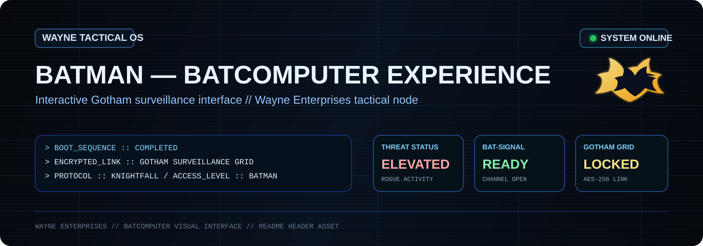
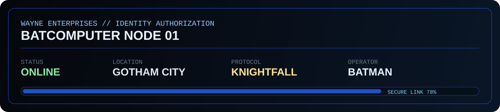
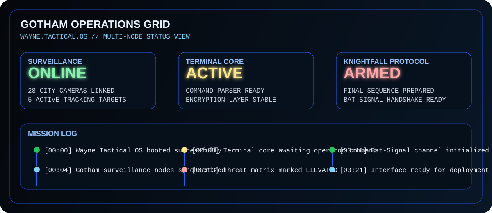
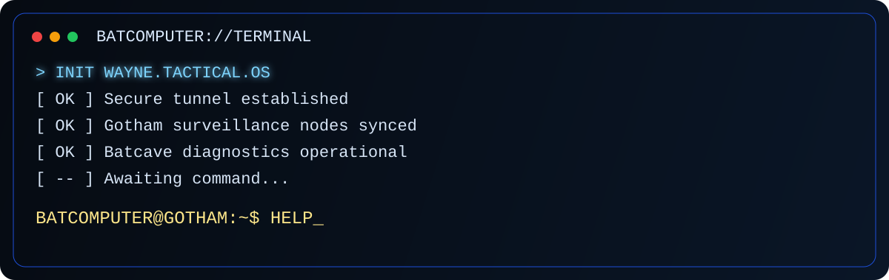

<p align="center">
  
</p>

<p align="center">
  
  
  
  
</p>

<p align="center">
  
  
  
</p>

<p align="center">
  
</p>

> **Batman — Batcomputer Experience** is an unofficial, non-commercial Batman fan project built as a cinematic React/Vite microsite. The interface is designed to feel like a Wayne tactical console — combining Gotham surveillance, command-terminal interactions, classified dossiers, and noir interface storytelling.

<p align="center">
  
</p>

## `SYSTEM // OVERVIEW`

### Mission
Build a stylized **Batcomputer-inspired portfolio / microsite experience** that blends cinematic UI direction, layered Gotham worldbuilding, command-terminal interactions, scroll-reactive storytelling, and responsive front-end engineering.

### Core Experience
- **Cinematic hero reveal** with cursor/touch-driven identity transitions
- **Scroll-reactive atmosphere** with layered Gotham-noir presentation
- **Batcomputer terminal** for command-style interactions
- **Surveillance nodes** and **classified dossiers** for exploration
- **Batcave diagnostics** and tactical system readouts
- **Knightfall protocol** and **Bat-Signal finale**
- **Responsive layout**, keyboard access, visible focus states, and reduced-motion support

<p align="center">
  
</p>

## `BOOT // LIVE SYSTEM PANEL`

<p align="center">
  
</p>

<p align="center">
  
</p>

## `TERMINAL // COMMAND CORE`

<p align="center">
  
</p>

```bash
BATCOMPUTER@GOTHAM:~$ HELP

AVAILABLE COMMANDS
──────────────────────────────────
SCAN GOTHAM
OPEN ARKHAM
OPEN WAYNE TOWER
LOCATE JOKER
LOCATE RIDDLER
BATCAVE
ACTIVATE SIGNAL
BATMAN
```

```text
> INITIALIZING WAYNE TACTICAL OS...
> Establishing encrypted connection...
> Syncing Gotham surveillance network...
> Loading case files and rogue dossiers...
> ACCESS GRANTED.
```

<p align="center">
  
</p>

## `MODULES // SYSTEM STATUS`

| Module | Status | Description |
|---|---:|---|
| Hero Reveal Engine | `ONLINE` | Cursor/touch-driven cinematic entry experience |
| Gotham Atmosphere Layer | `ONLINE` | Motion, depth, and noir worldbuilding |
| Terminal Interface | `ACTIVE` | Batcomputer-style command console |
| Surveillance Nodes | `LOCKED` | Exploratory city points and intel navigation |
| Rogue Dossier System | `ENCRYPTED` | Character/case-driven story modules |
| Batcave Diagnostics | `READY` | Tactical system and equipment readouts |
| Knightfall Protocol | `ARMED` | Final identity-state transition / finale sequence |

<p align="center">
  
</p>

## `DOSSIERS // CLASSIFIED FILES`

<details>
<summary><strong>OPEN DOSSIER // JOKER</strong></summary>
<br />
Agent of chaos. Suitable for corrupted UI patterns, psychological tension, and volatile high-threat narrative flavor.
</details>

<details>
<summary><strong>OPEN DOSSIER // RIDDLER</strong></summary>
<br />
Puzzle-driven adversary. Ideal for hidden interactions, encrypted clues, and investigative discovery loops.
</details>

<details>
<summary><strong>OPEN DOSSIER // ARKHAM</strong></summary>
<br />
Atmospheric content zone representing instability, containment, and psychological unease inside Gotham's criminal ecosystem.
</details>

<details>
<summary><strong>OPEN DOSSIER // WAYNE TOWER</strong></summary>
<br />
The public-facing side of Gotham power, technology, wealth, and corporate identity.
</details>

<details>
<summary><strong>OPEN DOSSIER // BATCAVE</strong></summary>
<br />
Operational core for diagnostics, tactical tools, surveillance oversight, and mission-control presentation.
</details>

<p align="center">
  
</p>

## `STACK // TECHNOLOGY`

```yaml
frontend:
  - React
  - Vite
  - JavaScript / HTML / CSS

experience:
  - Scroll-reactive storytelling
  - Cinematic composition
  - Interactive terminal patterns
  - Responsive UI behavior
  - Accessibility-minded controls
```

<p align="center">
  
</p>

## `MISSION LOG // RELEASE NOTES`

```text
LOG_001 :: Batcomputer-inspired fan interface initialized
LOG_002 :: Cinematic React/Vite microsite architecture established
LOG_003 :: Surveillance nodes and dossier storytelling added
LOG_004 :: Terminal interaction layer activated
LOG_005 :: Knightfall / Bat-Signal narrative finish armed
```

## `PROTOCOL // CONTRIBUTING`

```text
1. Maintain Gotham-noir visual consistency.
2. Preserve accessibility and reduced-motion support.
3. Keep terminal commands concise and immersive.
4. Ensure new sections feel like tactical modules, not generic pages.
5. Test responsiveness before deployment.
```

<p align="center">
  
</p>

## `DEPLOYMENT // LOCAL ACCESS`

```bash
# clone repository
git clone https://github.com/vaikashhari/Batman-intro.git

# enter project
cd Batman-intro

# install dependencies
npm install

# start development server
npm run dev

# build for production
npm run build

# preview production build
npm run preview
```

<p align="center">
  
</p>

## ✦ CREDITS // PROJECT

<p align="center">
  <strong>Built by Creatary Labs</strong><br />
  <sub>Interactive web experiment · 2026</sub>
</p>

<p align="center">
  
</p>
## `SYSTEM NOTICE // DISCLAIMER`

> This is an **unofficial, non-commercial Batman fan project**. Batman and related names, characters, and marks belong to their respective rights holders, including **DC** and **Warner Bros.** This project is a creative / portfolio experiment and is **not affiliated with, endorsed by, or an official product of DC or Warner Bros.**

---

<p align="center">
  <strong>WAYNE ENTERPRISES // BATCOMPUTER INTERFACE</strong><br />
  <sub>Connection secured • Surveillance active • Gotham watching</sub>
</p>
